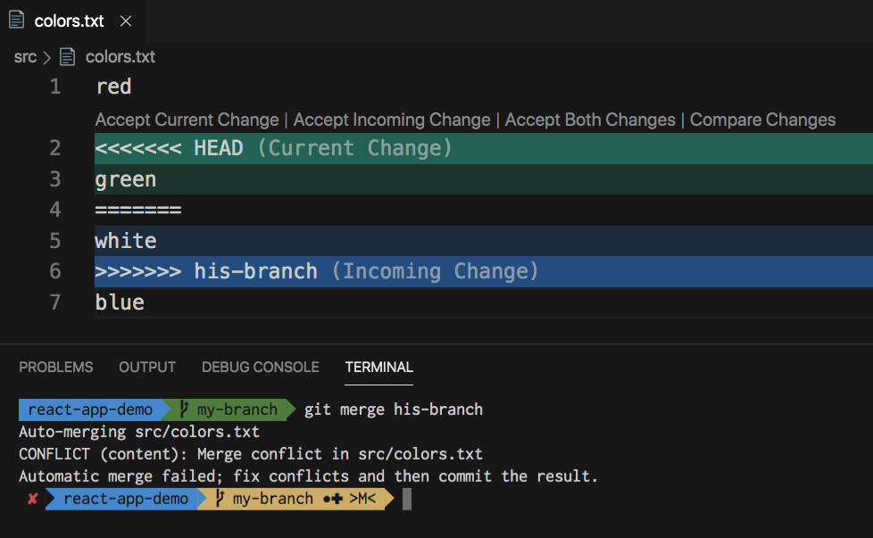

<h2>O que são branches?</h2>

As branches são como ambientes isolados dentro de um repositório. Elas permitem desenvolver recursos, testar novas funcionalidades de forma segura, sem afetar o ambiente principal (geralmente a branch main). As mudanças feitas em uma branch diferente da main ficam separadas das alterações feitas por outras pessoas da branch principal, o que permite implementar novas funcionalidades sem o risco de impactar diretamente o projeto.

<h2>Criar, mudar e deletar branches</h2>

O comando para criar uma branch no git é através do comando:

<pre><code>git branch [nome-da-branch]</code></pre>

Porém, é importante lembrar que ao criar uma branch, você permanece na sua branch atual. Para alterar da branch atual para a nova branch criada, você deve utilizar o comando:

<pre><code>git checkout [nome-da-branch]</code></pre>

Se for necessário deletar uma branch local, utilize o comando:

<pre><code>git branch -D [nome-da-branch]</code></pre>

Caso você precise deletar uma branch remota, utilize:

<pre><code>git push [nome-do-origin] [nome-da-branch] --delete</code></pre>

<h2>Git merge e como lidar com conflitos</h2>

O comando *git merge* é utilizado para fazer uma mesclagem entre duas branches. Normalmente utilizado para incorporar as mudanças feitas de uma branch, como uma branch de desenvolvimento de uma funcionalidade, na branch principal (main).

Para realizar o merge, primeiro mude para a branch onde será aplicado as mudanças (por exemplo, a branch main), e execute o comando:

<pre><code>git merge [nome-da-branch]</code></pre>

*(A branch no comando deverá ser a branch de onde virá as mudanças que serão incorporadas)*

Se as alterações entre as branches forem compatíveis, o Git realizará o merge automaticamente. Mas em caso de mudanças conflitantes em um mesmo trecho de código, ocorrerá um conflito de merge.

Nesses casos, o Git irá sinalizar os arquivos com conflitos, marcando as partes que precisam ser resolvidas manualmente. O trecho de código conflitado ficará assim:

Você deve escolher qual versão manter, ou incorporar as duas. Depois de resolver os conflitos, é preciso adicionar os arquivos modificados com:

<pre><code>git add [arquivo]</code></pre>

E finalizar o merge com um novo commit:

<pre><code>git commit -m [mensagem]</code></pre>

Esse processo garante que o histórico do projeto fique consistente e que todas as alterações sejam integradas corretamente.
